# ReageCFO: AI-Controlled Sovereign Treasury
## ETHGlobal Buenos Aires 2025 - Finals Presentation

---

## Slide 1: Title
### ReageCFO – AI-Controlled Sovereign Treasury

**Subtitle:** The World's First Living Treasury System

**Presenter:** Wesley Rios  
**Event:** ETHGlobal Buenos Aires 2025

**Speaker Notes:**
> "Hi everyone, I'm Wesley. And today I'm showing you something that doesn't exist yet in finance — a Treasury system that is **alive**. Not software that records what happened, but software that **makes decisions**, **manages funds**, **enforces controls**, and **settles money across chains** without human intervention."

---

## Slide 2: The Problem
### Treasury Systems Are Passive – And That's Dangerous

**The Silent Threat: Reconciliation Drift**

Every CFO deals with the same problem:

1. **Bank moves money** → Happens now
2. **ERP updates** → 2 hours later
3. **Treasury dashboard** → 4 hours later

**Result:** No system sees the whole picture

**The Core Issue:**
- Modern Treasury, SAP, Oracle = **Passive databases**
- They tell you what happened
- They don't control what should happen
- Creates: Errors, delays, settlement mismatches, impossible automation

**Speaker Notes:**
> "Every CFO in the world deals with the same silent threat: **reconciliation drift**. Your bank moves money. ERP updates later. Your treasury dashboard updates even later. **No system sees the whole picture**. Today's treasury stack — Modern Treasury, SAP, Oracle — are **passive databases**. They only tell you what already happened. They do not control what should happen. This creates errors, delays, settlement mismatches, and makes automation nearly impossible."

---

## Slide 3: The Insight
### Treasury Needs a "Living Ledger" – Not Just Storage

**The Solution: A Treasury That Thinks**

ReageCFO is the world's first AI-controlled Sovereign Treasury, where the ledger is the **brainstem** of your organization's money.

**Four Core Capabilities:**

🧠 **Thinks** - Analyzes invoices and market conditions  
⚖️ **Decides** - Approves or rejects payments autonomously  
🔒 **Enforces Invariants** - Double-entry accounting, zero-sum ledger  
⛓️ **Settles Cross-Chain** - Atomic settlement via LayerZero

**Speaker Notes:**
> "So I built **ReageCFO** — the world's first AI-controlled Sovereign Treasury, where the ledger isn't just storage… **It is the brainstem of your organization's money.** It **thinks**. It **decides**. It **enforces invariants**. And it **settles funds across chains**."

---

# PART 1: THE SYSTEM "COMES ALIVE"

---

## Slide 4: AI Agent Boots Up
### When an Invoice Arrives, the AI Takes Over

**Step 1: AI Agent Analyzes Invoice**

**Live Demo Starting...**

```
Invoice Received:
- ID: INV-LIVE-xxx
- Amount: 0.0001 ETH
- Vendor: Acme Cloud Services
- Recipient: 0x742D35CC6634c0532925A3b844BC9E7595F0BEb0
```

**What happens:**
1. Invoice arrives automatically
2. AI agent loads invoice data
3. Extracts vendor, amount, recipient
4. Begins processing pipeline

**Speaker Notes:**
> "When a company receives an invoice, no human accountant needs to process it. The AI Treasury Agent starts analyzing automatically."

**Demo Action:** Start running `node live_v2_demo.js` in terminal

---

## Slide 5: Pyth Network Price Fetch
### The Treasury Checks Market Safety Before Every Payment

**Step 2: Real-Time Market Data**

**Pyth Network Integration:**

📊 **ETH/USD Price:** $2,742.32  
📈 **Confidence:** ±$1.19  
⏰ **Updated:** Real-time (< 1 second old)  
💰 **Payment Value:** $0.2742 USD

**Why This Matters:**
- Treasury won't pay during volatile markets
- Configurable price thresholds
- Risk-sensitive decision making
- Market-aware treasury management

**Speaker Notes:**
> "The first thing our Treasury checks is market safety. Using **Pyth Network**, I fetch real-time ETH/USD prices before approving any payment. So the treasury won't pay during volatile markets, or if ETH drops below a configured threshold. This is **market-aware treasury management** — autonomous and risk-sensitive."

**Demo Action:** Terminal shows Pyth price fetch in progress

---

## Slide 6: Coinbase CDP – AI Identity
### The AI Signs the Transaction – Not a Human

**Step 3: Autonomous Signing**

**Coinbase CDP Server Wallet:**
- Address: `0xBCD8c885E3bc0F87940eAdA431e14cA9F3Fc98E0`
- Balance: 0.9416 ETH
- Type: **Server Wallet** (AI-controlled)
- Human access: **None**

**AI Decision Logic:**
```
✅ ETH price > $2000: PASS ($2,742.32)
✅ Payment < $5000: PASS ($0.2742)
✅ Invoice valid: PASS

DECISION: APPROVE PAYMENT
```

**Why This Matters:**
- AI is a **first-class blockchain citizen**
- No human in the loop
- Autonomous signing
- Production-ready identity management

**Speaker Notes:**
> "Next, the Agent signs the transaction — **not me**. Not a dev. Not a multisig. The Agent has its own identity thanks to **Coinbase CDP**. This is the first treasury system where the AI is a **first-class blockchain citizen**."

**Demo Action:** 
1. Terminal shows CDP wallet signing
2. Switch to browser: Show CDP wallet on Etherscan
3. Point out: Balance, recent transactions, no human control

---

## Slide 7: EVVM Sovereign Ledger
### The Heart: Double-Entry Accounting On-Chain

**Step 4: Ledger Recording**

**EVVM Sovereign Ledger:**
- Contract: `0xEDC4e211FE792f9B76605850567DD8b98A67A7E4`
- Network: Sepolia (EVVM-enhanced)
- Function: `sendCrossChainPayment()`

**Core Guarantees:**
- ✅ **Double-entry accounting** - Debits = Credits (enforced on-chain)
- ✅ **Zero-sum ledger** - Money never appears or disappears
- ✅ **Atomic operations** - All or nothing
- ✅ **Rollback safety** - Automatic recovery if settlement fails

**Transaction Sent:**
```
TX Hash: 0x9ec4ae3792f24bcc394445d4f0e4996c36b401fcb7abaea141a2dc20b47a0c95
Status: Success ✅
Block: 9685190
Gas Used: 364,046
```

**Speaker Notes:**
> "The payment reaches the heart: our **Sovereign Ledger**, deployed on **EVVM**. This ledger enforces **double-entry accounting natively on-chain**. Debits must equal credits — impossible to break. This guards against bugs, race conditions, and even AI hallucinations."

**Demo Action:**
1. Terminal shows transaction sent
2. Switch to browser: Show transaction on Etherscan
3. Point out: Success status, CDP wallet signature, function call

---

# PART 2: TIGERBEETLE DNA

---

## Slide 8: TigerBeetle's "Financial Tension"
### We Adopted TigerBeetle's Core Primitives for Safety

**The Breakthrough: Reserve → Commit Pattern**

```mermaid
stateDiagram-v2
    [*] --> Available: Initial Balance

    Available --> Pending: Reserve Funds<br/>(Create Financial Tension)
    
    note right of Pending
        💡 TigerBeetle Pattern
        Funds held in "tension"
        Not yet committed
        Can be rolled back
    end note

    Pending --> InTransit: LayerZero Message Sent
    
    note right of InTransit
        ⛓️ Cross-chain Settlement
        Message in flight
        Awaiting confirmation
    end note

    InTransit --> Settled: Message Delivered ✅
    InTransit --> Available: Settlement Failed ❌<br/>(Automatic Rollback)
    
    note right of Settled
        ✅ Commit Complete
        Funds released
        Double-entry balanced
        Debits = Credits
    end note

    Settled --> [*]: Transaction Complete

    note left of Available
        🔒 Safety Guarantees:
        • No lost funds
        • No stuck transactions
        • Automatic rollback
        • Zero-sum ledger
    end note
```



**Three Core Primitives:**

**1. Reserve → Commit (Capturing Tension)**
- Treasury never sends money instantly
- Creates **Pending State** - funds held in "tension"
- If LayerZero fails → **automatic rollback**
- No loss, no stuck funds, no bridge risk

**2. Double-Entry Invariants (Zero-Sum Ledger)**
- Money never appears or disappears
- EVVM enforces mathematically at execution time
- Guards against bugs and AI hallucinations

**3. Linked Batching + Async Nonces (High Throughput)**
- TigerBeetle can run 1M TPS
- We implemented the same idea with EVVM's async nonces
- Enables parallel execution (proof coming next)

**Speaker Notes:**
> "Now here is the real breakthrough. We adopted **TigerBeetle's core primitives** for real-world financial safety. The treasury never sends money instantly. It creates a **Pending State**, holding funds in 'Financial Tension.' This is how real finance works. If LayerZero settlement fails, the ledger **rolls back automatically**. No loss. No stuck funds. No bridge risk. Treasury safety requires that money never appears or disappears. EVVM enforces this **mathematically at execution time**. TigerBeetle can run 1M TPS. We took the same idea and implemented it with **EVVM's async nonces**. Well, here's the proof."

**Demo Action:** Show transaction logs on Etherscan (pending state captured)

---

# PART 3: THE "MIC DROP"

---

## Slide 9: V3 Parallel Execution
### 3 Payments, Same Block, Proven On-Chain

**High-Throughput Parallel Execution**

```mermaid
sequenceDiagram
    participant Batch as 📦 Batch Invoices
    participant Agent as 🤖 AI Agent<br/>(CDP Wallet)
    participant Ledger as 🏛️ EVVM V3 Ledger<br/>(Sepolia)
    participant LZ as ⛓️ LayerZero
    participant Vault as 💰 Vault<br/>(Base Sepolia)

    Note over Batch,Vault: V3: High-Throughput Parallel Execution

    Batch->>Agent: 3 invoices received<br/>simultaneously
    
    Note over Batch: Invoice A: Cloud Provider A<br/>Invoice B: Cloud Provider B<br/>Invoice C: Cloud Provider C

    Agent->>Agent: Process all 3<br/>in parallel

    par Transaction 1
        Agent->>Ledger: sendCrossChainPaymentAsync()<br/>Async Nonce: 1763844456777<br/>Invoice A
        Note over Ledger: TX1: 0x9ff56db9...
    and Transaction 2
        Agent->>Ledger: sendCrossChainPaymentAsync()<br/>Async Nonce: 1763844456778<br/>Invoice B
        Note over Ledger: TX2: 0x92817a3a...
    and Transaction 3
        Agent->>Ledger: sendCrossChainPaymentAsync()<br/>Async Nonce: 1763844456779<br/>Invoice C
        Note over Ledger: TX3: 0x9efefa72...
    end

    Note over Ledger: 🎯 All 3 TXs in SAME BLOCK<br/>Block 9685199<br/>Total time: 8.2 seconds

    Ledger->>Ledger: Process with async nonces<br/>No sequential dependency<br/>High throughput enabled

    par Message 1
        Ledger->>LZ: Cross-chain message 1
        LZ->>Vault: Deliver payment A
    and Message 2
        Ledger->>LZ: Cross-chain message 2
        LZ->>Vault: Deliver payment B
    and Message 3
        Ledger->>LZ: Cross-chain message 3
        LZ->>Vault: Deliver payment C
    end

    Note over Batch,Vault: ✅ 3 Payments Complete<br/>Parallel Execution Proven<br/>0.37 tx/sec throughput

    Note over Ledger: 💡 Advanced Features:<br/>✅ Async Nonces<br/>✅ EVVM ID: 2<br/>✅ MATE NameService<br/>✅ Executor Pattern
```



**The Proof:**

**Block 9685199** - All 3 transactions in the SAME BLOCK:

1. **TX1:** `0x9ff56db947fe95f992499e2dc68ac83cc6fb71665960821c94f6e6951969bb9c`
   - Async Nonce: 1763844456777
   - Gas: 338,135
   - Status: Success ✅

2. **TX2:** `0x92817a3acc2ba25a4995e762f1d83904c28b7c51a09e7bd84bf9a11e61902546`
   - Async Nonce: 1763844456778
   - Gas: 338,123
   - Status: Success ✅

3. **TX3:** `0x9efefa726d3e364513d2a3ab8abbcd866ac46a0d297168320c7d8e0002963955`
   - Async Nonce: 1763844456779
   - Gas: 338,135
   - Status: Success ✅

**Performance:**
- **Total Time:** 8.2 seconds
- **Throughput:** 0.37 tx/sec
- **Same Block:** Proves true parallel execution

**Speaker Notes:**
> "This is the V3 demo. Three independent payments — all approved by AI, signed by CDP, validated by EVVM — **processed in parallel**. In traditional treasury systems, these payments would execute **sequentially**. Here, they land in the **same block**, proving high-frequency treasury operations on-chain."

**Demo Action:**
1. Switch to browser: Show Block 9685199 on Etherscan
2. Scroll to transactions
3. Highlight all 3 TXs from CDP wallet
4. Point out: Same block, same sender, all successful
5. Click on one TX to show async nonce in input data

**Energy:** THIS IS THE MIC DROP - pause for effect after showing the block

---

# PART 4: LAYERZERO SETTLEMENT

---

## Slide 10: LayerZero Message Delivery
### Ledger-Driven, Atomic Cross-Chain Settlement

**Step 5: Cross-Chain Settlement**

**V2 Complete Flow:**


**LayerZero Integration:**
- **Source:** Sepolia (EVVM Ledger)
- **Destination:** Base Sepolia (Vault)
- **Message:** Payment data + recipient + amount
- **Status:** DELIVERED ✅

**Why This Matters:**
- Ledger-driven settlement (not manual)
- Atomic cross-chain operations
- Guaranteed delivery or rollback
- No cron jobs, no reconciliation

**Speaker Notes:**
> "Once the ledger approves and financial tension is captured, the treasury initiates settlement using **LayerZero**. This is **ledger-driven, atomic cross-chain settlement**."

**Demo Action:**
1. Switch to browser: Show LayerZero Scan
2. URL: https://testnet.layerzeroscan.com/tx/0x9ec4ae37...
3. Point out: Source (Sepolia), Destination (Base), DELIVERED status
4. Show message path visualization

---

## Slide 11: Vault Releases Funds
### The Final Step: Automated Fund Release

**Step 6: Vault Execution**

**VendorVault on Base Sepolia:**
- Contract: `0x23742F2F911Ed434081177e5aA9DB6a5684ba0dC`
- Network: Base Sepolia
- Function: `lzReceive()` → releases funds

**What Happens:**
1. LayerZero message arrives at vault
2. Vault verifies message authenticity
3. Vault releases funds to vendor
4. Vendor receives 0.0001 ETH
5. Payment complete ✅

**No Manual Steps:**
- ❌ No manual reconciliation
- ❌ No cron jobs
- ❌ No guesswork
- ✅ Fully automated settlement

**Speaker Notes:**
> "And the final step — the vault releases funds **only when LayerZero arrives cleanly**. No manual reconciliation. No cron jobs. No guesswork."

**Demo Action:**
1. Switch to browser: Show vault on Base Sepolia
2. URL: https://sepolia.basescan.org/address/0x23742F2F911Ed434081177e5aA9DB6a5684ba0dC
3. Click "Events" tab
4. Show PaymentReceived events
5. Point out: Funds released to vendors

---

# PART 5: FUTURE UX

---

## Slide 12: MATE NameService
### A Treasury That Speaks Human

**Human-Readable Payments**

**MATE NameService Integration:**

Instead of:
```
Pay to: 0x742D35CC6634c0532925A3b844BC9E7595F0BEb0
```

You can:
```
Pay to: acme.mate
```

**Why This Matters:**
- Human-readable addresses
- Reduced errors
- Better UX for treasury operators
- Production-ready naming

**V3 Implementation:**
- Contract: `0xDfE96d2D70f5D1438Ef3593C977F0BfD13569d97`
- Function: `payByName(string mateName, ...)`
- EVVM ID: 2
- NameService: `0x93DFFaEd15239Ec77aaaBc79DF3b9818dD3E406A`

**Speaker Notes:**
> "In V3, we also added **MATE NameService**, so you can pay 'acme.mate' instead of 0x742d… A treasury that **speaks human**."

---

# PART 6: THE CLOSE

---

## Slide 13: The Four Components
### The Sovereign Treasury of the Future

**A Living System**

```mermaid
graph TB
    subgraph "🧠 AI Layer"
        Agent[🤖 AI Treasury Agent<br/>Coinbase CDP Wallet<br/>0xBCD8...98E0]
    end

    subgraph "👁️ Data Layer"
        Pyth[📊 Pyth Network<br/>Real-time Price Feeds<br/>ETH/USD: $2,742.32]
    end

    subgraph "❤️ Ledger Layer - Sepolia"
        V2[🏛️ ApertureServiceV2<br/>0xEDC4...7E4<br/>Complete Flow]
        V3[🏛️ ApertureServiceV3<br/>0xDfE9...9d97<br/>Async Nonces]
    end

    subgraph "🤝 Messaging Layer"
        LZ[⛓️ LayerZero V2<br/>Cross-chain Messages<br/>Sepolia → Base]
    end

    subgraph "💰 Settlement Layer - Base Sepolia"
        Vault[💰 VendorVault<br/>0x2374...a0dC<br/>Funds Release]
    end

    subgraph "👥 Recipients"
        Vendor[👤 Vendors<br/>Payment Recipients]
    end

    Agent -->|Fetch Prices| Pyth
    Pyth -->|Market Data| Agent
    
    Agent -->|Sign & Send| V2
    Agent -->|Sign & Send| V3
    
    V2 -->|Cross-chain Message| LZ
    V3 -->|3 Parallel Messages| LZ
    
    LZ -->|Deliver| Vault
    
    Vault -->|Release Funds| Vendor
```



**The Four Components:**

🧠 **The Brain: Coinbase CDP**
- AI identity on-chain
- Autonomous signing
- Server Wallet management

👁️ **The Eyes: Pyth Network**
- Real-time price feeds
- Market awareness
- Risk-sensitive decisions

❤️ **The Heart: EVVM**
- Sovereign ledger
- Double-entry accounting
- Async nonces for parallel execution

🤝 **The Hands: LayerZero**
- Cross-chain messaging
- Atomic settlement
- Omnichain operations

**Plus: TigerBeetle Physiology**
- Reserve → Commit pattern
- Financial tension
- Automatic rollback
- Zero-sum ledger

**Speaker Notes:**
> "This treasury has: **the Brain**: Coinbase CDP. **the Eyes**: Pyth Network. **the Heart**: EVVM sovereign ledger. **the Hands**: LayerZero for settlement. And the **TigerBeetle physiology** tying it all together."

**[Pause for 2 seconds]**

> "You're not just looking at a payment demo. You're looking at what corporate treasury will become: **AI-native, cross-chain, safe-by-default, and financially aware**. A living system. This is the **sovereign treasury of the future**."

**Demo Action:** Hold on this slide, make eye contact with judges

**Energy:** Strong close, confident, visionary

---

## Slide 14: Thank You
### Questions?

**ReageCFO - AI-Controlled Sovereign Treasury**

**Built for ETHGlobal Buenos Aires 2025**

**Key Links:**
- GitHub: github.com/ReageMeuFilho/ReageCFO
- V2 TX: `0x9ec4ae3792f24bcc394445d4f0e4996c36b401fcb7abaea141a2dc20b47a0c95`
- V3 Block: `9685199`
- LayerZero Scan: testnet.layerzeroscan.com

**Contact:**
- Wesley Rios
- @ReageMeuFilho

**Sponsor Integrations:**
- 🏛️ EVVM - Sovereign Ledger + Async Nonces
- 💙 Coinbase CDP - AI Identity
- 📊 Pyth Network - Real-time Prices
- ⛓️ LayerZero - Cross-chain Settlement

**Speaker Notes:**
> "Thank you. Happy to answer questions."

---

## 📊 Presentation Metadata

**Total Slides:** 14  
**Total Time:** ~3 minutes 20 seconds  
**Demo Type:** Hybrid (Live V2 + Pre-recorded V3 proof)  
**Mermaid Diagrams:** 4 embedded  
**Browser Tabs Needed:** 5  
**Terminal Commands:** 1  

**Timing Breakdown:**
- Intro: 45 seconds (Slides 1-3)
- V2 Demo: 50 seconds (Slides 4-7)
- TigerBeetle: 25 seconds (Slide 8)
- V3 Parallel: 25 seconds (Slide 9)
- LayerZero: 25 seconds (Slides 10-11)
- Close: 30 seconds (Slides 12-14)

**Key Moments:**
- **Slide 4:** Start live demo
- **Slide 6:** Switch to browser (CDP wallet)
- **Slide 7:** Show transaction on Etherscan
- **Slide 9:** THE MIC DROP (Block 9685199)
- **Slide 10:** LayerZero Scan
- **Slide 13:** Strong closing statement

---

## 🎯 Gamma Import Instructions

1. Copy this entire markdown file
2. Go to Gamma.app
3. Click "Import"
4. Paste the markdown
5. Gamma will automatically:
   - Create all 14 slides
   - Render all 4 Mermaid diagrams
   - Format text and layouts
   - Apply professional styling

6. Review and adjust:
   - Colors (use sponsor colors if possible)
   - Font sizes
   - Spacing
   - Add your logo/branding

7. Export or present directly from Gamma

**Note:** Mermaid diagrams will be rendered automatically by Gamma. No need to manually create images!

---

**You're ready to crush the finals! 🚀🇦🇷**
